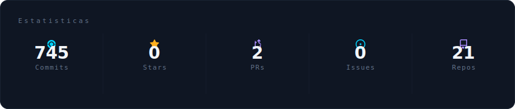

<!-- Galaxy Profile README Template
     Customize this file with your own info, then rename it to README.md
     in your GitHub profile repo (github.com/YOUR_USERNAME/YOUR_USERNAME).
     The SVG paths below point to assets/generated/ which are auto-generated
     by the GitHub Actions workflow or by running: python -m generator.main -->

  

 

  

 

  

 

  

 

<strong>Sobre</strong>

 

Desenvolvedor de software dedicado em fullstack e mobile, com ampla experiência e graduando em ciência da computação na UFF. Especializado em desenvolver tanto sistemas greenfield quanto na evolução de legados. Me destaco por:

✓ Mobile: Flutter, React native, Swift, com experiência em deploy de aplicativos na playstore, appstore e geração de apks/ipas; 
✓ Frontend: React, Bootstrap, Tailwind, Javascript, Typescript, Wordpress, com experiência em deploy na nuvem (Vercel) e em servidores locais; 
✓ Backend: Ruby on Rails, Flask, FastAPI, Spring, Node, além de Docker, com experiência em deploy na nuvem (Render) e em servidores locais; 
✓ Bancos de dados: MySQL, PostgreSQL, SQLite Firebase, InfluxDB, Redis, com experiência em arquiteturas de mensageria utilizando RabbitMQ e Sidekiq; 
✓ Ferramentas: n8n, metodologias ágeis, controle de versionamento git + github e testes automatizados (TDD) 

Minha abordagem proativa, habilidades técnicas e proficiência em inglês me posicionam como um profissional preparado para enfrentar desafios e contribuir significativamente para o sucesso dos projetos em que me envolvo. 

**Atualmente em:** Universidade Federal Fluminense - Niterói, Rio de Janeiro

 

  
  

